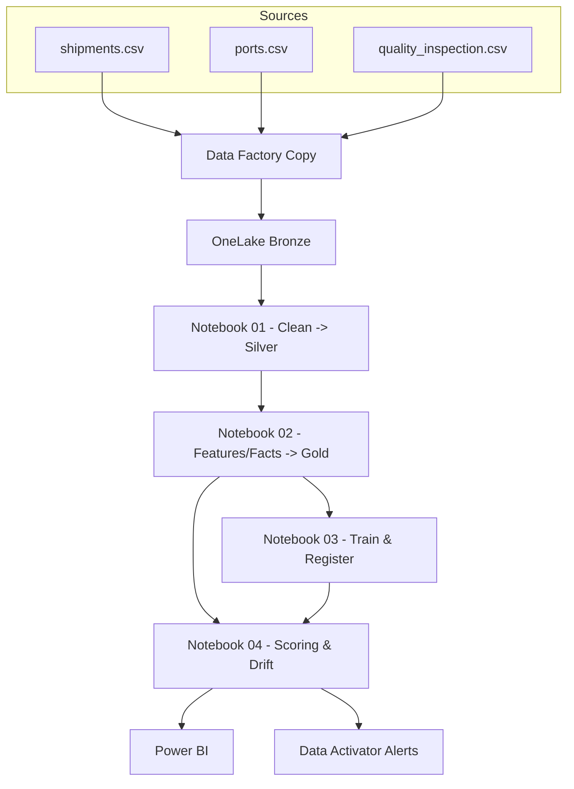

# Fabric Imports Medallion (Cacao Imports Demo)

Mini-projet **Microsoft Fabric** : architecture **médaillon** (Bronze/Silver/Gold) pour un importateur de cacao, + **ML simple** et **monitoring** (drift & réentraînement).

## 🎯 Objectifs
- Ingestion **CSV** (shipments, ports, quality) → **Bronze**
- Nettoyage & standardisation → **Silver**
- Modèle BI (dims/facts) + features ML → **Gold**
- **Modèle ML** (Logistic Regression) pour risque de retard
- **Monitoring** (drift PSI) + **réentraînement** planifié
- **CI minimal** (lint + tests + smoke notebooks)

## 📂 Données (mock)
- `data/ports.csv` — référentiel ports (code, pays, fuseau, attente moyenne)
- `data/shipments.csv` — BL/manifestes (vessel, ports, dates, poids)
- `data/quality_inspection.csv` — inspections (humidité, défauts, taille)

## 🧱 Modèle Médaillon

## 🧪 Notebooks (suggestion)
1. `01_silver_clean.ipynb` : lire Bronze → nettoyer → écrire Silver
2. `02_gold_features.ipynb` : construire `fact_*` + `features_delay` (Gold)
3. `03_train_model.ipynb` : entraîner LogReg (MLflow) sur `features_delay`
4. `04_batch_scoring_and_monitoring.ipynb` : scoring + PSI (Evidently)

## ✅ CI minimal (GitHub Actions)
- Lint (`ruff`, `black`)
- Tests (`pytest`)
- Smoke notebooks (`papermill`)

## 🚀 Démarrage rapide
1. **Créer un workspace** Fabric + un **Lakehouse**
2. **Data Factory → Copy Data** : `data/*.csv` → tables Bronze
3. Exécuter les notebooks 01 → 04
4. Brancher Power BI sur Gold
5. Créer une règle Data Activator si `psi_score > 0.2` → alerte + réentraînement

## 📝 Licence
MIT (démo pédagogique)
