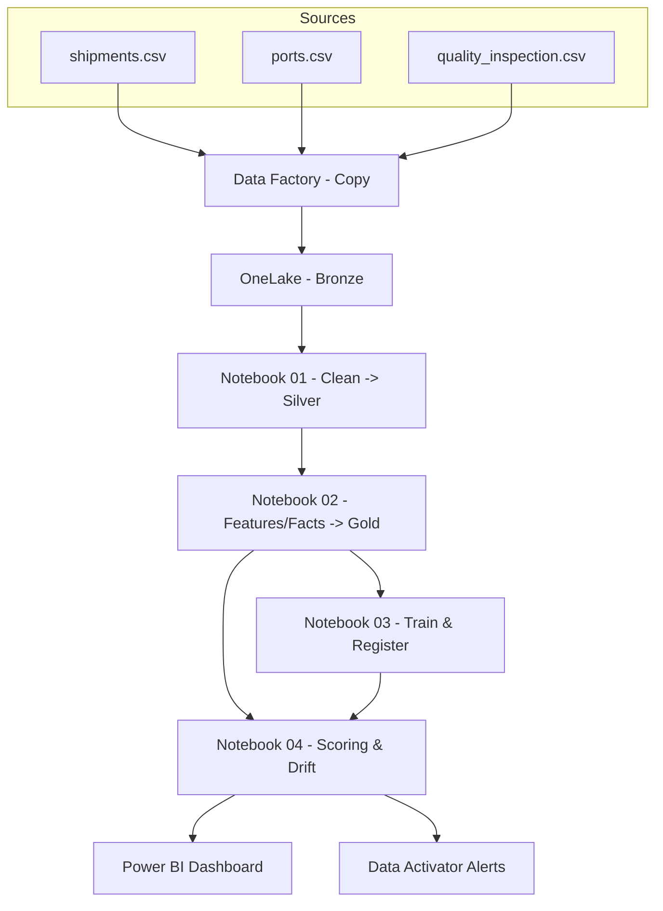

# Cacao Fabric Medallion — Bronze → Silver → Gold (+ ML & Monitoring)

Mini-projet **Microsoft Fabric** prêt à déployer pour démontrer un pipeline **de bout en bout** :
- Ingestion **CSV** → **Bronze**
- Nettoyage/standardisation (Notebook PySpark) → **Silver**
- Modèle **Gold** (Warehouse : dims/facts + features ML)
- **Modèle ML** simple (Logistic Regression) + **monitoring** (drift/PSI) + réentraînement
- **Power BI** pour la BI (KPI traçabilité & opérations)
- **CI minimal** (optionnel) pour préparer le futur CD

> Objectif : servir de POC “mission freelance basique mais complète” pour un importateur type **Sucden** (cacao/café/sucre).

---

## 🌐 Prérequis
- Compte **Microsoft Fabric** (trial 60 jours) → crée-le depuis https://app.fabric.microsoft.com (Start trial).
- Workspace Fabric (ex. `Cacao-POC`).

---

## 🗂️ Structure du dépôt
```
cacao-fabric-medallion/
├─ data/                         # Fichiers CSV mock (démo)
│  ├─ ports.csv
│  ├─ shipments.csv
│  └─ quality_inspection.csv
├─ notebooks/                    # À créer dans Fabric (4 notebooks)
├─ tests/                        # (optionnel) tests unitaires & spark
├─ docs/
│  └─ architecture.md            # schéma & notes complémentaires
├─ .github/workflows/ci.yml      # (optionnel) CI minimal
├─ .gitignore
└─ README.md
```

---

## 🧱 Architecture (médaillon)


---

## 🚀 Étapes express (clic-par-clic)

### 0) Créer le workspace & Lakehouse
1. Fabric → **Start trial** → **Workspaces ▸ New** (`Cacao-POC`).
2. **New ▸ Lakehouse** (`cacao_lakehouse`).

### 1) Bronze — Ingestion des CSV
1. Dans le Lakehouse, volet **Files** → **Upload** les CSV de `data/` :
   - `ports.csv`, `shipments.csv`, `quality_inspection.csv`
2. **Data Factory ▸ Copy Data** vers tables Delta **bronze** :
   - `bronze.ports_raw`, `bronze.shipments_raw`, `bronze.quality_raw`

### 2) Silver — Nettoyage (Notebook 01)
- Crée **Notebook** attaché à `cacao_lakehouse` et écris :
  - `silver.ports`, `silver.shipments`, `silver.quality` (types fixés, dates, duplicats).

### 3) Gold — Features & Facts (Notebook 02 + Warehouse)
- Construis `gold.fact_shipments`, `gold.fact_quality`, `gold.features_delay`.
- **New ▸ Warehouse** (`cacao_warehouse`) puis **Views SQL** pour la BI.

### 4) ML — Entraînement & Scoring (Notebooks 03 & 04)
- `03_train_model.ipynb` : Logistic Regression, registre **MLflow**.
- `04_batch_scoring_and_monitoring.ipynb` : scoring + **PSI** (drift) → table `gold.ml_monitoring`.

### 5) BI & Alertes
- **Power BI Report** branché sur `cacao_warehouse` (Gold).
- **Data Activator** : règle si `psi_score > 0.2` → alerte + (option) exécuter Notebook 03 (réentraînement).

---

## 🧪 Notebooks — contenu suggéré
- `01_silver_clean.ipynb` : lire Bronze → nettoyer → Silver.
- `02_gold_features.ipynb` : dims/facts + features ML → Gold.
- `03_train_model.ipynb` : Logistic Regression (accuracy en métadonnée MLflow).
- `04_batch_scoring_and_monitoring.ipynb` : scoring + PSI (Evidently).

Des **exemples de snippets** sont fournis dans l’historique de la conversation (et faciles à copier).

---

## 🧰 (Optionnel) CI minimal
Un workflow **ci.yml** peut :
- Lancer `ruff`/`black`,
- Exécuter `pytest`,
- **Re-jouer les notebooks** (smoke) avec `papermill`.

> Tu pourras activer plus tard le **CD** via **Fabric Deployment Pipelines** (Dev → Test → Prod).

---

## ▶️ Démarrage local
1. Installe Python 3.11 et crée un venv.
2. `pip install -r requirements.txt`
3. (Optionnel) `pytest -q`

---

## 📦 Push vers GitHub
```bash
git init
git add .
git commit -m "init: cacao fabric medallion (bronze→silver→gold + ml)"
git branch -M main
git remote add origin https://github.com/<ton-user>/cacao-fabric-medallion.git
git push -u origin main
```

---

## 📄 Licence
MIT — usage pédagogique / démonstration.
